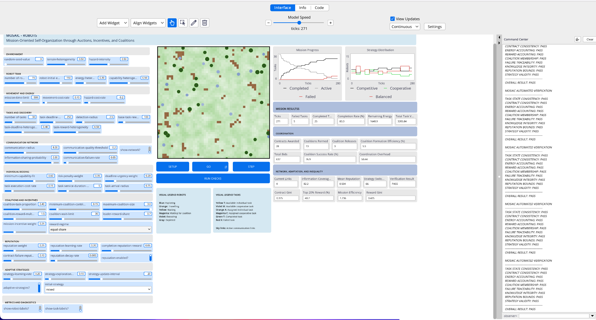

# MOSAIC

## Mission-Oriented Self-Organization through Auctions, Incentives, and Coalitions

MOSAIC is an agent-based model of decentralized mission coordination among
heterogeneous robots operating in a spatially complex, partially observable,
and communication-constrained environment.

The model examines whether local incentives, auctions, communication, coalition
formation, reputation, and adaptive strategies can transform decentralized
competition into coherent mission-level coordination without a central planner.



---

## Release status

| Item | Status |
|---|---|
| Model version | `0.4.0` |
| Release date | `2026-07-30` |
| NetLogo version | `7.0.4` |
| Model format | `.nlogox` |
| Model implementation | Complete |
| Automated verification | 9 internal checks passed |
| Official experiments | BS01–BS07 complete |
| Official run-level records | 690 |
| ODD Protocol | Complete |
| User Manual | Complete |
| Experimental Design and Results | Complete |
| Technical Report | Complete - academic format |
| LaTeX manuscript | Complete - journal-neutral manuscript |
| Public repository tag | Pending |
| DOI or archival identifier | Pending |
| Model and code licence | `Apache-2.0` |
| Documentation, figures, and data licence | `CC-BY-4.0` |

This repository contains the prepared `v0.4.0` model, documentation,
experimental evidence, and analysis materials. The version date is `2026-07-30`. The archival DOI will be added after
publication through CoMSES or another archival service.

---

## Research question

> Under what conditions can incentive mechanisms transform decentralized
> competition among heterogeneous robots into self-organized mission
> coordination without central supervision?

MOSAIC treats mission coordination as more than task completion. It separates
final mission outcomes from the processes required to produce them:

- task discovery;
- local information diffusion;
- communication-network formation;
- decentralized bidding;
- individual contract allocation;
- cooperative coalition construction;
- synchronization and execution;
- reward distribution;
- reputation updating;
- adaptive strategy selection;
- contract release and reassignment.

This distinction makes it possible to identify systems that complete many tasks
but do so through excessive bidding, delayed coalition formation, unequal
reward allocation, or high coordination overhead.

---

## Model overview

MOSAIC represents a team of heterogeneous robots working in a synthetic
51 × 51 toroidal environment. The world contains spatial variation in terrain
cost, hazard, communication quality, and visibility.

Robots differ in:

- sensing capability;
- manipulation capability;
- transport capability;
- communication capability;
- speed;
- energy;
- risk tolerance;
- reputation;
- bidding strategy.

Tasks differ in:

- spatial location;
- reward;
- deadline;
- service duration;
- risk;
- required capabilities;
- individual or cooperative execution requirements.

Some tasks can be completed by one robot. Cooperative tasks require a temporary
coalition whose combined capabilities meet several simultaneous requirements.

No external planner computes a global assignment. Tasks act as local
auctioneers, robots submit bids from incomplete knowledge, and coalitions are
constructed from the available bids.

---

## Coordination cycle

Each model tick executes the following sequence:

1. Evaluate task deadlines.
2. Move active robots.
3. Detect nearby tasks.
4. Reconstruct the temporary communication network.
5. Exchange task information synchronously across active links.
6. Open auctions for discovered and unassigned tasks.
7. Allow each free robot to submit at most one positive-utility bid.
8. Resolve individual auctions and cooperative coalition formation.
9. Move assigned robots toward their contracts.
10. Synchronize coalition members and execute tasks.
11. Release invalid or delayed contracts when necessary.
12. Update reputation and adaptive strategies.
13. Refresh monitors, plots, and visual state.

The model stops when the mission time limit is reached, all robots are
depleted, or no active tasks remain.

---

## Main mechanisms

### Heterogeneous robot capabilities

Each robot has four task-relevant capabilities. Individual bidding requires a
minimum normalized fit. Cooperative bidding permits partial contributions that
can become feasible when aggregated within a coalition.

### Partial observability

Tasks begin undiscovered and invisible. Robots obtain task identifiers through
local sensing or one-hop communication. Knowledge persists after acquisition.

### Dynamic communication

Communication links are temporary and reconstructed every tick. Link formation
depends on:

- distance;
- local environmental communication quality;
- robot communication capability;
- a minimum quality threshold;
- stochastic link failure.

Information sharing is synchronous, preventing multi-hop cascades within a
single tick.

### Decentralized auctions

A free robot evaluates known, active tasks and submits at most one bid per tick.
Bid utility combines:

- expected reward;
- deadline urgency;
- capability contribution;
- estimated travel and execution cost;
- task risk;
- robot risk tolerance;
- reputation;
- current strategy.

### Coalition formation

Cooperative tasks rank bidders by capability contribution and bid utility. A
greedy heuristic adds robots until team-size and aggregate capability
requirements are met or the coalition-size limit is reached.

The heuristic is intentionally bounded and local. It may fail to find a
combination that a complete combinatorial search could identify.

### Reward regimes

The model includes four reward-allocation regimes:

- `leader-priority`;
- `equal-share`;
- `contribution-based`;
- `mission-aligned`.

These regimes affect expected bid value and final payment distribution.

### Reputation

Successful contracts increase reputation. Failed or released contracts reduce
it. Reputation gradually decays toward the neutral value of `0.50`.

### Adaptive strategies

Robots may use one of three strategies:

- `competitive`;
- `cooperative`;
- `balanced`.

When adaptation is enabled, robots update learned strategy values from reward
minus energy expenditure and select future strategies through an
epsilon-greedy rule.

---

## Quick start

### Requirements

- NetLogo `7.0.4`
- The model file:
  `model/MOSAIC_v0.4.0.nlogox`

### Run the validated manual baseline

1. Open `model/MOSAIC_v0.4.0.nlogox` in NetLogo 7.0.4.
2. Set `random-seed-value` to `42`.
3. Press `SETUP`.
4. Press `GO`.
5. Allow the model to stop automatically.
6. Press `RUN CHECKS`.
7. Confirm that the Command Center reports:

```text
OVERALL RESULT: PASS
```

### Principal baseline settings

```text
number-of-robots = 15
robot-initial-energy = 150
energy-heterogeneity = 0.30
capability-heterogeneity = 0.50

number-of-tasks = 30
mission-time-limit = 500
movement-cost-rate = 0.10

communication-radius = 8
communication-quality-threshold = 0.25
communication-failure-rate = 0.05

coalition-task-proportion = 0.40
maximum-coalition-size = 3

reward-regime = "equal-share"
reputation-enabled? = true
adaptive-strategies? = true
initial-strategy = "mixed"
```

For a one-tick inspection, use `STEP` instead of `GO`. Enable
`show-network?`, `show-robot-labels?`, and `show-task-labels?` only when visual
diagnosis is required.

---

## Automated verification

The `RUN CHECKS` procedure evaluates nine invariants:

1. Task-state consistency
2. Contract consistency
3. Energy accounting
4. Reward accounting
5. Coalition membership
6. Failure traceability
7. Knowledge integrity
8. Reputation bounds
9. Strategy validity

A verification pass establishes internal consistency for the tested model
state. It does not establish empirical validity or physical safety.

Five verification indicators were also recorded for all 690 official
BehaviorSpace runs:

- task-state consistency;
- energy accounting;
- reward accounting;
- reputation bounds;
- strategy validity.

All recorded run-level checks passed.

---

## Experimental programme

The official v0.4.0 programme uses 30 paired random seeds per condition.

| ID | Experiment | Conditions | Runs |
|---|---|---:|---:|
| BS01 | Baseline Replication | 1 | 30 |
| BS02 | Reward Regime Comparison | 4 | 120 |
| BS03 | Communication Degradation | 4 | 120 |
| BS04 | Capability Heterogeneity | 3 | 90 |
| BS05 | Cooperative Task Demand | 3 | 90 |
| BS06 | Reputation × Adaptation | 4 | 120 |
| BS07 | Mission Incentive Strength | 4 | 120 |
| **Total** |  |  | **690** |

All experiments use:

```text
setup command = setup
go command = go
random seeds = 1–30
run metrics every step = false
update view = false
maximum duration = 500 ticks
```

The canonical harmonized dataset is:

```text
experiments/processed/MOSAIC_All_Experiments_Master_Runs.csv
```

The primary integrated analysis workbook is:

```text
analysis/MOSAIC_BS01_BS07_Integrated_Analysis.xlsx
```

---

## Key results

### Baseline performance

Across 30 baseline seeds:

- mean completion rate: `92.22%`;
- completion-rate standard deviation: `6.80` percentage points;
- 23 of 30 runs reached at least `90%` completion;
- 4 runs reached full completion;
- mean information coverage: approximately `95.16%`;
- mean Reward Gini: approximately `0.296`;
- mean Contract Gini: approximately `0.259`.

Most baseline failures occurred before successful assignment rather than during
execution. Of 70 failures, 38 were associated with auctions or no feasible
allocation, and 28 remained undiscovered.

### Reward regimes

Reward allocation affected inequality and auction friction more than mission
completion.

- No significant completion difference was detected across the four regimes.
- `leader-priority` produced substantially more unresolved auction rounds.
- `leader-priority` also produced the highest reward inequality.
- `equal-share` preserved strong performance without the additional
  concentration generated by leader-priority.

### Communication

Communication reach was more consequential than moderate temporary link
failure.

Increasing communication radius from 4 to 8 produced approximately:

- `+3.56` percentage points in completion;
- `+7.36` percentage points in information coverage;
- `−6.03` isolated robots;
- `−32.80` ticks in coalition delay;
- lower coordination overhead;
- higher mission efficiency.

Raising link failure from `0.05` to `0.35` altered network structure but did
not create a robust completion decline.

### Capability heterogeneity

The relationship between capability heterogeneity and completion was
non-monotonic:

| Capability heterogeneity | Mean completion |
|---:|---:|
| `0.0` | `86.56%` |
| `0.5` | `92.22%` |
| `1.0` | `86.00%` |

Moderate heterogeneity provided useful complementarity without creating the
matching burden observed under extreme heterogeneity.

### Cooperative-task demand

Increasing cooperative-task proportion produced a nonlinear capacity limit:

| Cooperative-task proportion | Mean completion |
|---:|---:|
| `0.0` | `98.89%` |
| `0.4` | `92.22%` |
| `0.8` | `75.67%` |

At high cooperative demand, 77.6% of failures were associated with no feasible
allocation. The dominant constraint was coalition formation capacity rather
than the execution quality of coalitions already formed.

### Reputation and adaptation

Neither reputation nor adaptive strategies produced a robust main effect on
completion.

Adaptive conditions still generated approximately 52 strategy switches per
run, confirming that the mechanism was active. The combined
reputation-and-adaptation condition reduced coalition delay by approximately
9.65 ticks beyond the additive expectation, suggesting a process-level effect
without a reliable completion gain.

### Mission incentives

Increasing mission-incentive weight substantially increased payments but did
not produce a statistically reliable completion improvement.

The evidence indicates incentive saturation: stronger payments changed economic
outputs more than mission outcomes.

---

## Integrated conclusion

The experimental evidence supports the following release-level conclusion:

> In MOSAIC v0.4.0, self-organized mission performance depends primarily on
> information reach, capability complementarity, and coalition-formation
> capacity. Incentives shape fairness and coordination behaviour, but they do
> not independently guarantee superior mission completion.

The main development priority is therefore not a stronger reward mechanism. It
is better decentralized partner discovery, capability matching, and coalition
formation.

---

## Repository structure

```text
.
├── README.md
├── LICENSE
├── LICENSE-CODE
├── LICENSE-DOCUMENTATION
├── NOTICE
├── CITATION.cff
├── CHANGELOG.md
├── CONTRIBUTING.md
├── .gitignore
├── AUTHORSHIP_AND_CREDIT.md
├── model/
│   └── MOSAIC_v0.4.0.nlogox
├── documentation/
│   ├── MOSAIC_Info_Tab_v0.4.0.md
│   ├── MOSAIC_ODD_Protocol_v0.4.0.md
│   ├── MOSAIC_User_Manual_v0.4.0.md
│   └── MOSAIC_Experimental_Design_and_Results_v0.4.0.md
├── experiments/
│   ├── raw/
│   ├── processed/
│   ├── summaries/
│   ├── Data_Dictionary.md
│   └── Validation_Report.md
├── analysis/
│   ├── integrated and experiment-specific workbooks
│   ├── hypothesis-tests/
│   └── previews/
├── figures/
│   ├── analytical-report/
│   └── technical-report/
├── report/
│   ├── MOSAIC_v0.4.0_Technical_Report.pdf
│   └── MOSAIC_v0.4.0_Technical_Report.docx
├── paper/
│   ├── main.tex
│   ├── supplementary_material.tex
│   ├── references.bib
│   ├── figures/
│   └── MOSAIC_Manuscript_v1.pdf
└── quality-assurance/
    ├── MODEL_STATIC_VALIDATION.md
    ├── AUTHORSHIP_AUDIT.csv
    ├── ENGLISH_ONLY_LANGUAGE_AUDIT.md
    ├── GITHUB_RELEASE_AUDIT.md
    ├── PACKAGE_MANIFEST.csv
    └── SHA256SUMS.txt
```

---

## Documentation

### Embedded model overview

[Info Tab](documentation/MOSAIC_Info_Tab_v0.4.0.md)

Concise in-model overview covering purpose, operation, visual interpretation,
outputs, experimental findings, verification, authorship, and limitations.

### Model specification

[ODD Protocol](documentation/MOSAIC_ODD_Protocol_v0.4.0.md)

Formal description of purpose, entities, state variables, scheduling, design
concepts, initialization, inputs, submodels, assumptions, limitations, metrics,
and verification.

### Operational guidance

[User Manual](documentation/MOSAIC_User_Manual_v0.4.0.md)

Installation, quick start, interface controls, monitors, plots, Command Center
diagnostics, BehaviorSpace, export, reproducibility, verification, and
troubleshooting.

### Experimental evidence

[Experimental Design and Results](documentation/MOSAIC_Experimental_Design_and_Results_v0.4.0.md)

Paired-seed design, statistical methods, BS01–BS07 findings, integrated
interpretation, limitations, and development implications.

### Technical report

[Technical Report PDF](report/MOSAIC_v0.4.0_Technical_Report.pdf)

Academic-format synthesis of the model specification, ODD structure,
verification, experimental programme, statistical evidence, integrated
findings, limitations, and reproducibility. The editable DOCX is available in
`report/`.

## Archival records

### Manuscript

The associated MOSAIC manuscript is archived on Zenodo:

https://doi.org/10.5281/zenodo.21718799

### Computational model

The initial public MOSAIC release is archived on CoMSES Net.

A revised release is currently undergoing computational-model peer review.
### Data reference
### Data reference

[Data Dictionary](experiments/Data_Dictionary.md)

Definitions for the harmonized run-level variables.

[Validation Report](experiments/Validation_Report.md)

Validation of raw run counts, processed row counts, and the 690-record master
dataset.

---

### Repository metadata

- [Citation metadata](CITATION.cff)
- [Changelog](CHANGELOG.md)
- [Contribution guidelines](CONTRIBUTING.md)
- [Authorship and credit](AUTHORSHIP_AND_CREDIT.md)
- [Licensing overview](LICENSE)


---


## Data integrity and reproducibility

Files under `experiments/raw/` are immutable evidence. They should not be
opened and re-saved in spreadsheet software, altered, or replaced by processed
files.

Derived data are stored separately:

- `experiments/processed/`;
- `experiments/summaries/`;
- `analysis/`.

The package includes:

- `quality-assurance/PACKAGE_MANIFEST.csv`;
- `quality-assurance/SHA256SUMS.txt`;
- source-file mapping;
- language audit;
- authorship audit;
- static model validation.

Exact reproduction requires:

- the same model file;
- NetLogo 7.0.4;
- identical parameter values;
- identical random seeds;
- unchanged BehaviorSpace definitions;
- unchanged stopping conditions;
- no direct manual modification of agent state.

---

## Project origin and development

MOSAIC was initially developed by Katherin Molina as a final project for the
*Introduction to Agent-Based Modeling* course offered through Complexity
Explorer.

The model was subsequently extended and further developed in collaboration
with Lorena Holguin, Software Engineer at Kahlo Group.

The current release includes the expanded multi-layer model, verification
suite, 690-run experimental programme, processed datasets, integrated
statistical analysis, ODD Protocol, User Manual, and experimental-results
documentation.

---

## Authors and affiliations

**Katherin Molina**  
Independent Researcher, Australia

**Lorena Holguin**  
Software Engineer, Kahlo Group

Lorena Holguin's professional affiliation with Kahlo Group is provided for
identification purposes only. Kahlo Group did not fund, sponsor, supervise,
validate, or endorse this project.

---

## Institutional disclaimer

This project is an independent work by the authors.

Complexity Explorer and the Santa Fe Institute provided the academic context
for the initial course project but do not own, sponsor, validate, or endorse
the model, its experimental results, or its conclusions.

Kahlo Group is listed only as Lorena Holguin's professional affiliation and is
not a project sponsor or institutional partner.

---

## Scope and limitations

MOSAIC is a research simulation. It is not:

- a deployable controller for physical robots;
- a safety-certified autonomous system;
- a field-calibrated predictor;
- evidence that a mechanism will transfer unchanged to mining, defence,
  agriculture, environmental monitoring, or other physical missions.

The model omits, among other elements:

- low-level vehicle dynamics;
- collision avoidance;
- physical interference;
- detailed communication protocols;
- bandwidth and latency;
- dynamic task arrival;
- adversarial behaviour;
- strategic defection;
- human intervention;
- empirical platform calibration.

Findings must be interpreted conditionally on the implemented mechanisms,
parameter ranges, and experimental design.

---

## Citation

Machine-readable citation metadata are provided in `CITATION.cff`. Until a
repository DOI is assigned, use the following version-specific citation:

```text
Molina, K., & Holguin, L. (2026). MOSAIC: Mission-Oriented
Self-Organization through Auctions, Incentives, and Coalitions
(Version 0.4.0) [Agent-based model and experimental dataset].
```

Do not cite Complexity Explorer, the Santa Fe Institute, or Kahlo Group as the
author or publisher of the project.

---

## Licence and reuse

Copyright © 2026 Katherin Molina and Lorena Holguin.

This repository uses a dual-licensing structure:

- the NetLogo model and source code are licensed under the
  [Apache License 2.0](LICENSE-CODE);
- the original documentation, figures, experimental datasets, processed data,
  analyses, and report materials are licensed under the
  [Creative Commons Attribution 4.0 International licence](LICENSE-DOCUMENTATION).

See the repository [licensing overview](LICENSE) and [NOTICE](NOTICE) for
scope, attribution, and institutional disclaimers.

---

## Contact and project status

The public repository URL, release tag, archival identifier, and citation
metadata will be added during publication.

Current release:

```text
v0.4.0 — 2026-07-30
```
